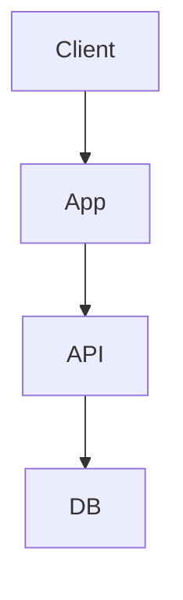
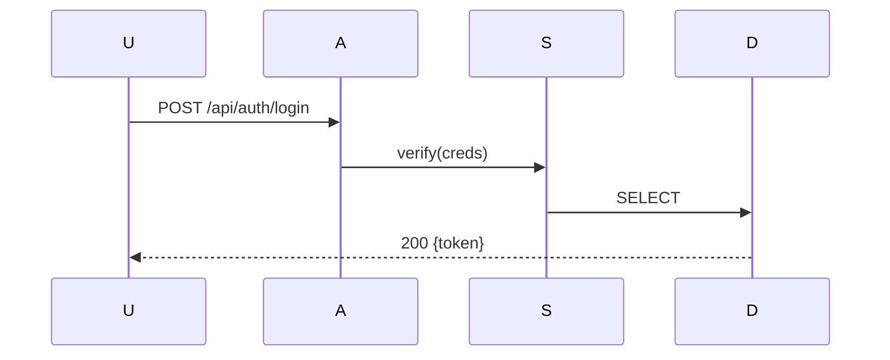

# architecture-map

## Procedure

1. Scan file_tree → read pkg manifest → identify {modules, roles, deps, entries} → map data flows
2. Write `.ai/PROJECT_MAP.md` (DenseCode):
```
# PROJECT_MAP
## Meta
Proj:<name> | Stack:{<fw>} | PkgMgr:<mgr> | Lang:<lang>
Entry:<file> | Port:<port>
## Tree
/src
  /app -> роль (entry)
  /services -> бизнес-логика (gold_std:auth.service.ts)
  /components -> UI
## Flows
Flow:auth -> usr:login -> svc:verify -> db:select -> jwt:sign => token ✅
## Deps
app -> {services, components} | services -> {utils, db}
## Gold Standards
service: src/services/auth.service.ts
```
3. Write `.foryou/PROJECT_MAP.md` (Markdown + Mermaid):
```markdown
# 🗺️ Карта проекта: <Name>
## Обзор
<что делает, для кого>
## Стек
| Категория | Технология | Версия |
|-----------|-----------|--------|
## Архитектура

## Потоки данных

## Ключевые решения
| Решение | Почему | Альтернативы |
```
4. Verify: оба файла покрывают все модули и синхронизированы
5. **Инкрементальное обновление**: новый модуль/flow/dep → обновить ОБА файла. Удалённый → убрать из обоих.

→ After: consider `session-handoff`
