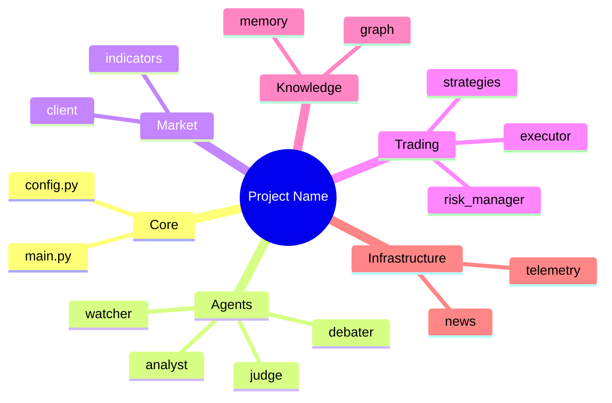
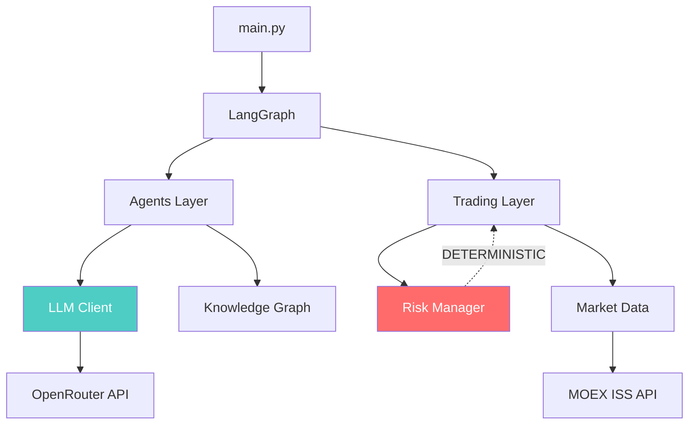
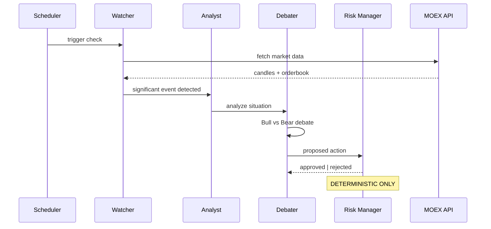
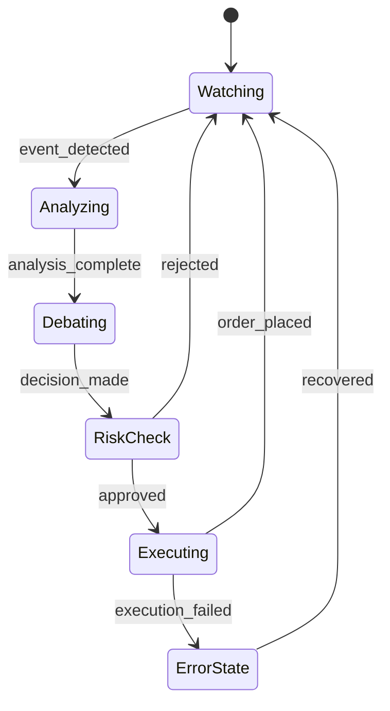

# Mermaid Templates for architecture-map

## Mindmap (project overview)


## Architecture graph


## Sequence diagram (data flow)


## File tree (copy-paste template)
```
project/
├── src/
│   ├── config.py           — Description
│   ├── main.py             — Description
│   ├── module_a/           — Description
│   │   ├── file_1.py       — Description
│   │   └── file_2.py       — Description
│   └── module_b/           — Description
├── tests/                  — Description
├── .ai/                    — AI context (DenseCode)
└── .foryou/                — Human docs (Russian)
```

## State diagram (for LangGraph)

