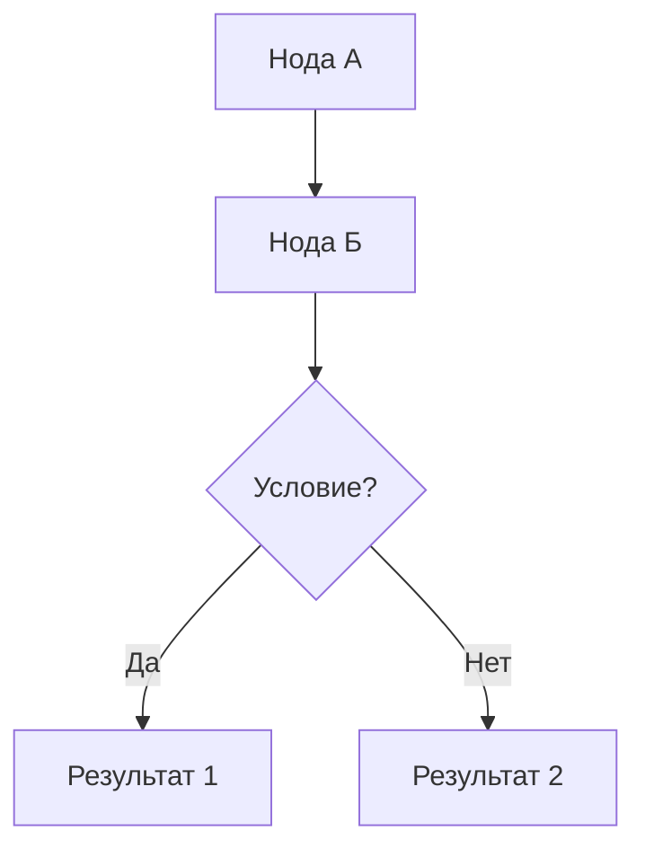

# 📝 Obsidian Docs — Скилл документирования

## Цель
Создать качественную документацию (или добавить существующий файл из `docs/`) в Obsidian vault через MCP `obsidian`.

---

## Шаги выполнения

### ШАГ 1 — Понять, что документируем

Определи тип задачи:

| Тип | Признак | Действие |
|-----|---------|----------|
| **Новая заметка** | Пользователь просит задокументировать фичу/модуль | Создать файл с нуля (→ ШАГ 2) |
| **Синхронизация `docs/`** | Пользователь упоминает файл из `docs/` или "sync" | Прочитать через `view_file`, синхронизировать (→ ШАГ 3) |
| **Обновление** | Файл уже есть в vault | Прочитать текущий через `vault_read`, обновить (→ ШАГ 4) |

Для любого типа — прочитай контекст проекта:
```
# Проверь существующие заметки в разделе:
call_mcp_tool(obsidian, vault_list, {"path": "AI SaaS/<раздел>/"})
```

---

### ШАГ 2 — Создание новой заметки (стандарт)

#### Структура файла

Каждая заметка начинается с YAML frontmatter:

```yaml
---
title: "📌 <Название>"
tags:
  - <тег1>          # например: архитектура, бизнес, ai-агент
  - <тег2>
aliases:
  - <Псевдоним 1>   # альтернативные имена для поиска
created: YYYY-MM-DD
status: design | active | deprecated
---
```

#### Структура тела заметки

```markdown
# 📌 Название — Подзаголовок

> [!quote] Краткое описание сути в 1 предложении

---

## 🏗️ Основная секция с Mermaid-схемой



## 📋 Детали (таблицы, описания)

| Колонка 1 | Колонка 2 | Колонка 3 |
|-----------|-----------|-----------|
| ...       | ...       | ...       |

> [!note] Важное замечание

## 🔗 Связанные заметки

- [[AI SaaS/Раздел/Файл]] — описание связи
```

#### Правила Mermaid (КРИТИЧНО — иначе парсер сломается)

- **НЕ используй скобки `()` в edge labels** `-->|текст (пояснение)|` → СЛОМАЕТ рендер
- **НЕ используй многобайтовые эмодзи с ZWJ** (👨‍💼) в node labels — используй простые (👤, 🧠, 📊)
- **Замена**: `|Да (HITL)|` → `|Да — HITL|`, `/` в edge labels → `-`
- **Тест-паттерн** для edge labels: только текст, `-`, `—`, цифры. Никаких `(){}[]`
- **Эмодзи в nodes** — ставь через `["🏷️ текст"]`, не `[🏷️ текст]`

#### Пути в vault по разделам проекта

```
AI SaaS/Архитектура/     ← технические компоненты системы
AI SaaS/AI Агенты/       ← LangGraph агенты
AI SaaS/Бизнес/          ← бизнес-модель, профили ниш
AI SaaS/Стек/            ← технологии и инфраструктура
AI SaaS/Разработка/      ← дорожная карта, фазы, статус
AI SaaS/Документация/    ← синхронизированные файлы из docs/
```

---

### ШАГ 3 — Синхронизация из `docs/`

Для файлов из папки `docs/` проекта:

```python
# 1. Прочитать локальный файл
view_file("/Users/seva/Projects/saas-platform/docs/<файл>")

# 2. Добавить frontmatter если нет
frontmatter = """---
tags:
  - документация
  - схема
source: docs/<путь_к_файлу>
created: YYYY-MM-DD
---\n\n"""

# 3. Записать в vault
call_mcp_tool("obsidian", "vault_write", {
    "path": "AI SaaS/Документация/<Название>.md",
    "content": frontmatter + <содержимое файла>
})
```

**Маппинг docs/ → Obsidian:**

| Локальный файл | Путь в Obsidian |
|---------------|-----------------|
| `docs/logical_map.md` | `AI SaaS/Документация/Логическая карта.md` |
| `docs/architecture/ai_agents.md` | `AI SaaS/Документация/Архитектура AI агентов.md` |
| `docs/architecture/backend.md` | `AI SaaS/Документация/Архитектура бэкенда.md` |
| `docs/architecture/frontend.md` | `AI SaaS/Документация/Архитектура фронтенда.md` |
| `docs/architecture/bots_integrations.md` | `AI SaaS/Документация/Боты и интеграции.md` |
| `docs/ai-agents.md` | `AI SaaS/Документация/AI агенты описание.md` |
| `docs/implementation_plan.md` | `AI SaaS/Документация/План реализации.md` |

---

### ШАГ 4 — Обновление существующей заметки

```python
# 1. Прочитать текущее состояние
call_mcp_tool("obsidian", "vault_read", {"path": "AI SaaS/<раздел>/<файл>.md"})

# 2. Пропатчить (обновить) через vault_patch для частичного обновления
call_mcp_tool("obsidian", "vault_patch", {
    "path": "AI SaaS/<раздел>/<файл>.md",
    "content": "<новый/обновлённый блок>",
    "operation": "append"  # или "prepend", "replace"
})
```

---

### ШАГ 5 — Проверка результата

После записи всегда верифицируй:

```python
# Прочитать обратно и проверить
result = call_mcp_tool("obsidian", "vault_read", {"path": "..."})
# Убедись что:
# 1. Frontmatter присутствует
# 2. Mermaid-диаграммы корректны (нет скобок в edge labels)
# 3. Wiki-ссылки ведут на реальные файлы
```

---

## Чеклист качества заметки

- [ ] YAML frontmatter с `title`, `tags`, `aliases`, `created`, `status`
- [ ] Цитата `> [!quote]` с сутью в начале
- [ ] Минимум 1 Mermaid-диаграмма для технических заметок
- [ ] Таблицы для сравнений и параметров
- [ ] Wiki-ссылки `[[...]]` на связанные заметки
- [ ] Секция `## 🔗 Связанные заметки` в конце
- [ ] Правила Mermaid соблюдены (нет скобок в edge labels)
- [ ] Файл записан в правильный раздел vault

---

## Коллбэки к другим скиллам

- После создания архитектурной заметки → скилл `architecture-map` для обновления PROJECT_MAP
- После создания 5+ заметок → `session-handoff` для сохранения сессии
- При ошибке рендера → проверить Mermaid по правилам этого скилла (ШАГ 2)
